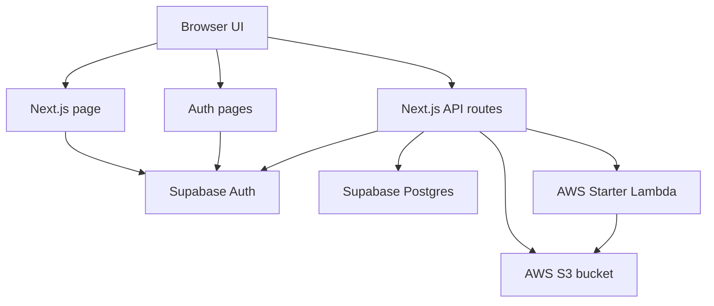

# Reframe Systems Design Deep Dive

This document describes the current architecture of Reframe.

Reframe is a private reflection app. It helps a signed-in user move through a guided emotional check-in, upload old journal material, and turn that material into structured entries that can be used later.

The system is now more than a prototype screen flow. It has an authenticated app shell, an ingestion API, AWS storage and processing hooks, and a Supabase database index.

## Current Reframe

Reframe has one visible product path and one backend capability.

The first path is the in-app reflection flow. A user signs in, sees a greeting, writes gratitude, chooses an activity, reflects on past entries, and writes a new response.

The backend capability is document ingestion [the process of taking raw uploaded files and turning them into usable app data]. The API can accept journal file uploads. It stores the raw files in S3 [AWS object storage, like a cloud filing cabinet for files]. It then starts an AWS Lambda [a small cloud function that runs only when called] to process those files. Processing progress is tracked through a manifest [a JSON status file that describes the current state of an ingestion job]. Extracted entries are stored as JSON files in S3, while Supabase stores searchable references to those files.

The design is split this way on purpose. Large content lives in S3. Small lookup data lives in Supabase. The app talks to both through server-side API routes [backend endpoints inside the Next.js app].

## Technology Stack

- Next.js App Router [Next.js routing model where pages and API routes live in the `app` folder].
- React [the UI library that renders the screens].
- TypeScript [JavaScript with type checks that catch many mistakes before runtime].
- Tailwind CSS [utility-first CSS where classes describe styling directly].
- Supabase Auth [Supabase's user login system].
- Supabase Postgres [a hosted SQL database, where data is stored in tables].
- AWS S3 [object storage for uploaded files, manifests, and extracted entry JSON].
- AWS Lambda [serverless compute, meaning code runs on demand without a managed server].
- AWS SDK [Amazon's JavaScript library for calling AWS services].

## High-Level Shape

The app is organized around a simple boundary.

The browser handles interaction. The server handles trust.

That means the browser can show screens and collect input, but it does not decide who owns data. Server routes check the signed-in user before reading or writing S3 and Supabase data.

Think of this like a clinic.

The browser is the front desk. It asks questions and shows forms. The server is the staff-only room. It checks identity, retrieves files, updates records, and starts background work.

## Main Runtime Layers

### 1. App Shell

The entry point is `src/app/page.tsx`.

It creates a Supabase server client and asks Supabase for the current user. If there is no user, it redirects to `/auth/login`.

If there is a user, it derives a display name from profile metadata [extra user info stored with the account] or from the email address. It then renders `App` with that `userName`.

`src/app/App.tsx` is the current guided reflection state machine [a UI pattern where the app moves between named states]. It keeps the current screen in React state. Each screen calls a handler when the user completes an action.

Current screens include:

- Greeting.
- Gratitude.
- Activity choice.
- Journal entry review.
- Reflection analysis.
- Reflection prompt.
- Reflection writing.
- Free writing.
- Completion and post-activity screens.

The app flow is currently local UI state. Written text is stored in memory during the session. It is not yet persisted to Supabase or S3 by the reflection UI.

### 2. Authentication

Auth is handled with Supabase.

The client-side auth screens live in:

- `src/app/auth/login/page.tsx`.
- `src/app/auth/log-in/page.tsx`.
- `src/app/auth/sign-up/page.tsx`.
- `src/app/components/auth/AuthLandingScreen.tsx`.
- `src/app/components/auth/AuthForm.tsx`.

The app supports Google OAuth [login through Google using a secure redirect flow] and email/password auth.

The callback route is `src/app/auth/callback/route.ts`. It receives the auth code from Supabase and exchanges it for a session [the signed-in state stored in cookies].

The sign-out route is `src/app/auth/sign-out/route.ts`. It clears the Supabase session and redirects back to login.

Middleware [code that runs before matching pages load] lives in `src/middleware.ts` and `src/lib/supabase/middleware.ts`.

It does three things:

- Refreshes Supabase cookies.
- Redirects signed-out users from `/` to `/auth/login`.
- Redirects signed-in users away from auth pages back to `/`.

API routes are excluded from the middleware matcher. This is okay because the API routes authenticate themselves through `getIngestionActor()`.

### 3. Supabase Server Clients

There are two Supabase client helpers.

`src/lib/supabase/client.ts` creates the browser client. It is used by login and signup forms.

`src/lib/supabase/server.ts` creates the server client. It reads and writes auth cookies through Next.js server APIs.

The helper throws if these environment variables are missing:

- `NEXT_PUBLIC_SUPABASE_URL`.
- `NEXT_PUBLIC_SUPABASE_ANON_KEY`.

These values are public in the browser, but security still comes from Supabase policies and server-side checks.

### 4. Ingestion Identity

`src/lib/ingestion/auth.ts` creates an ingestion actor [the authenticated user plus the database client and client record].

The main function is `getIngestionActor()`.

It:

1. Creates a Supabase server client.
2. Gets the signed-in Supabase user.
3. Finds or creates the user's primary client row.
4. Returns `{ supabase, user, clientId }`.

The `clientId` is a database identifier for the user's active client profile. This gives the system a stable place to attach entry records.

The app also has a database trigger [database code that runs automatically after an event] in `migrations/002_create_client_on_auth_signup.sql`. It creates the primary client when a new auth user is created.

The application still creates the primary client if the trigger has not run yet. This is a useful backup path.

## Data Model

Supabase stores relational data [data stored in tables with rows and relationships].

The main tables are `clients` and `entries`.

### clients

`clients` represents an app profile for a Supabase auth user.

Important columns:

- `client_id`: the primary key [the main unique ID for a row].
- `user_id`: the Supabase auth user ID.
- `name`: currently `primary`.
- `display_name`: the visible name.
- `is_active`: whether this client is active.
- `metadata`: flexible JSON data.

The table has a unique constraint [a database rule that prevents duplicates] on `(user_id, name)`.

### entries

`entries` stores references to extracted journal entries.

Important columns:

- `id`: database row ID.
- `user_id`: owner user.
- `client_id`: linked client profile.
- `entry_id`: stable entry identifier.
- `s3_key`: the S3 path to the JSON content.
- `source_file`: original file name, when available.
- `entry_date`: normalized date, when available.

The actual entry text stays in S3. Supabase stores the index.

This is like a library card catalog. The database card tells you what book exists and where it sits. The full book stays on the shelf.

## Row-Level Security

The migrations enable row-level security [database rules that decide which rows a user can access].

Both `clients` and `entries` use policies that restrict access to rows where `user_id = auth.uid()`.

This means a signed-in user can only select, insert, update, or delete their own rows.

The server routes also filter by `actor.user.id`. So ownership is checked in two places:

- In application code.
- In the database policy layer.

That is defense in depth [using more than one layer of protection].

## S3 Storage Layout

S3 keys [file paths inside an S3 bucket] are built in `src/lib/ingestion/s3-keys.ts`.

Current layouts:

- Temporary uploads: `uploads/{userId}/{ingestionId}/{clientFileId}-{fileName}`.
- Manifests: `ingestions/{userId}/{ingestionId}/manifest.json`.
- Entry JSON objects: `entries/{userId}/{file}.json` or `entries/{userId}/{ingestionId}/{file}.json`.
- Processing job mappings: `processing/jobs/{textractJobId}.json`.

The user ID is part of the key. This makes ownership clear in the storage path.

The API also checks that submitted upload keys belong to the signed-in user and ingestion ID. This prevents a user from submitting someone else's S3 object path.

## Ingestion Flow

The ingestion flow has four API routes.

### Step 1. Presign Uploads

Route: `POST /api/ingestion/presign`.

The browser sends file metadata:

- `clientFileId`.
- `name`.
- `contentType`.
- `size`.

The server:

1. Authenticates the user.
2. Validates file count, size, content type, and extension.
3. Creates a new `ingestionId`.
4. Builds user-owned S3 keys.
5. Returns pre-signed URLs [temporary upload URLs that let the browser upload directly to S3].

The default limits are:

- 20 files.
- 25 MB per file.
- PDF, JPG, JPEG, PNG, HEIC, and HEIF.

These can be changed through:

- `NEXT_PUBLIC_INGESTION_MAX_FILES`.
- `NEXT_PUBLIC_INGESTION_MAX_FILE_MB`.

### Step 2. Browser Uploads To S3

The browser uses each pre-signed URL to upload directly to S3.

The Next.js server does not stream the file bytes itself. This keeps the app server lighter. It works like giving the user a temporary loading dock pass, instead of making them carry every box through the front desk.

### Step 3. Submit Ingestion

Route: `POST /api/ingestion/submit`.

The browser sends the `ingestionId` and uploaded file records.

The server:

1. Authenticates the user.
2. Validates the `ingestionId`.
3. Validates the file metadata again.
4. Verifies each S3 key belongs to the user and ingestion.
5. Creates an initial manifest in S3.
6. Invokes the Starter Lambda asynchronously [starts work and returns without waiting for it to finish].

The manifest starts with status `QUEUED`.

If Lambda enqueueing fails, the manifest is marked `FAILED`. The submit route can retry only that enqueue failure case.

### Step 4. Poll Status

Route: `GET /api/ingestion/{ingestionId}/status`.

The server:

1. Authenticates the user.
2. Loads the manifest from S3.
3. Confirms the manifest belongs to the signed-in user.
4. Derives file statuses from manifest fields.
5. Updates the manifest if the derived status changed.
6. Returns totals and file records.

The status logic lives in `src/lib/ingestion/manifest.ts`.

File status is derived like this:

- `entryKey` means `COMPLETED`.
- `errorMessage` means `FAILED`.
- `textractJobId` or `sourceFinalKey` means `PROCESSING`.
- Otherwise the file is `QUEUED`.

Overall ingestion status is derived from file statuses. If every file completed, the ingestion is `COMPLETED`. If every file failed, it is `FAILED`. If some completed and some failed, it is `PARTIAL_FAILED`.

### Step 5. Fetch Results

Route: `GET /api/ingestion/{ingestionId}/results`.

The server:

1. Authenticates the user.
2. Loads the manifest.
3. Requires the ingestion to be terminal [finished, either success or failure].
4. Reads entry JSON objects from S3.
5. Normalizes extracted payloads.
6. Splits multi-entry payloads into one S3 object per entry when needed.
7. Upserts entry references into Supabase.
8. Returns entries, synced reference count, and entry keys.

The route accepts both single-entry JSON and wrapped arrays.

It also sanitizes entry IDs [removes unsafe characters so IDs are safe to store and compare].

When an extracted file contains many entries, the server writes separate objects under:

`entries/{userId}/{ingestionId}/{sourceBase}-{index}-{digest}.json`

The `digest` is a short SHA-256 hash [a compact fingerprint of the entry content]. It helps produce stable, unique names.

## Listing Entries

Route: `GET /api/entries`.

This route lists saved entry references for the signed-in user.

By default, it returns metadata only:

- `entry_id`.
- `s3_key`.
- `source_file`.
- `entry_date`.
- `created_at`.
- `updated_at`.

If the request includes `includeContent=true`, the route reads each S3 object and returns parsed entry content.

The `limit` query param controls result count. It defaults to 100 and is capped at 500.

This route is the bridge between storage and future app experiences. It gives the app a way to list entries without scanning the entire S3 bucket.

## API Error Model

The API uses plain JSON errors.

Common cases:

- `401 Unauthorized`: no signed-in user.
- `400 Bad Request`: invalid IDs, files, or ownership.
- `404 Not Found`: ingestion does not exist for the user.
- `409 Conflict`: results requested before ingestion is finished.
- `500 Internal Server Error`: unexpected server failure.
- `502 Bad Gateway`: Lambda enqueue failed.

This is simple and practical. The client can show clear states without needing special error formats yet.

## How The Pieces Work Together

The system has a clear handoff chain.

1. Supabase Auth proves who the user is.
2. The Next.js server turns the user into an ingestion actor.
3. S3 stores raw uploads, manifests, and extracted content.
4. Lambda performs background extraction outside the web request.
5. The status route reads the manifest to show progress.
6. The results route finalizes entries and writes database references.
7. Supabase indexes entries for quick listing and user ownership.

Each layer has one job.

Supabase Auth answers: "Who is this?"

Supabase Postgres answers: "What entries belong to this user?"

S3 answers: "Where are the full files and extracted JSON?"

Lambda answers: "How do raw files become extracted entries?"

Next.js answers: "How does the browser safely use all of this?"

## Environment Variables

Current expected variables are listed in `.env.example`.

Auth:

- `NEXT_PUBLIC_SUPABASE_URL`.
- `NEXT_PUBLIC_SUPABASE_ANON_KEY`.

AWS:

- `AWS_REGION`.
- `AWS_INGESTION_BUCKET`.
- `AWS_STARTER_LAMBDA_NAME`.
- `AWS_ACCESS_KEY_ID`.
- `AWS_SECRET_ACCESS_KEY`.
- `AWS_SESSION_TOKEN`, optional for temporary AWS credentials.

Ingestion limits:

- `NEXT_PUBLIC_INGESTION_MAX_FILES`.
- `NEXT_PUBLIC_INGESTION_MAX_FILE_MB`.

Debugging:

- `INGESTION_DEBUG=1` enables extra ingestion logs in the results route.

## Current Strengths

- User data is now scoped by Supabase user ID.
- API routes authenticate before touching storage.
- S3 paths include user IDs.
- Supabase row-level security adds database-side protection.
- Large content is kept out of Postgres.
- Manifests make background processing observable.
- Status can be derived from file fields, so the system can recover when a worker updates only part of the manifest.
- The results route can normalize older and newer entry object shapes.

## Current Gaps

The reflection UI does not yet save newly written text.

The ingestion UI is not visible in the inspected app flow yet. The backend routes exist, but the main app screens do not currently expose a complete upload experience.

The actual extraction worker is outside this repository. The API expects a Starter Lambda to update S3 manifests and write entry JSON.

There is duplicated body parsing and extracted-entry normalization across routes. This could become a shared helper.

The entry reference model stores metadata and S3 pointers, but not embeddings [numeric representations of text used for semantic search] or analysis output yet.

## Suggested Next Architecture Moves

### 1. Persist New Writing

The `WritingScreen` output should be saved to the same entry system.

That would make user-created reflections and imported entries share one storage model.

### 2. Add An Ingestion UI

The backend routes are ready for a frontend upload flow.

The UI should support:

- File selection.
- Upload progress.
- Submit state.
- Polling status.
- Result review.
- Error recovery.

### 3. Extract Shared Ingestion Helpers

Move duplicated helpers into shared modules.

Good candidates:

- S3 body parsing.
- Extracted entry validation.
- Extracted payload normalization.
- Entry key validation.

This reduces drift [when copied logic changes in one place but not another].

### 4. Add Entry Retrieval To The Reflection Flow

The reflection analysis screen currently behaves like a designed UI state.

The next systems step is to connect it to `/api/entries`, then select relevant entries for reflection prompts.

### 5. Add Observability

Observability [the ability to understand what the system is doing from logs and metrics] is still light.

Useful additions:

- Request IDs.
- Structured logs.
- Ingestion timing fields.
- Worker completion events.
- Clear admin visibility into failed files.

## Mental Model

Reframe is becoming a personal memory system.

The user-facing app is calm and guided. Underneath, the system is built like a pipeline [a set of steps where output from one step becomes input to the next].

The pipeline is:

`auth -> upload -> manifest -> worker -> extracted JSON -> database reference -> reflection experience`

The most important design choice is separation.

Identity is separate from content.

Raw files are separate from database rows.

Background processing is separate from page rendering.

The reflection interface is separate from ingestion storage.

That separation lets each part grow without forcing every other part to change at the same time.
